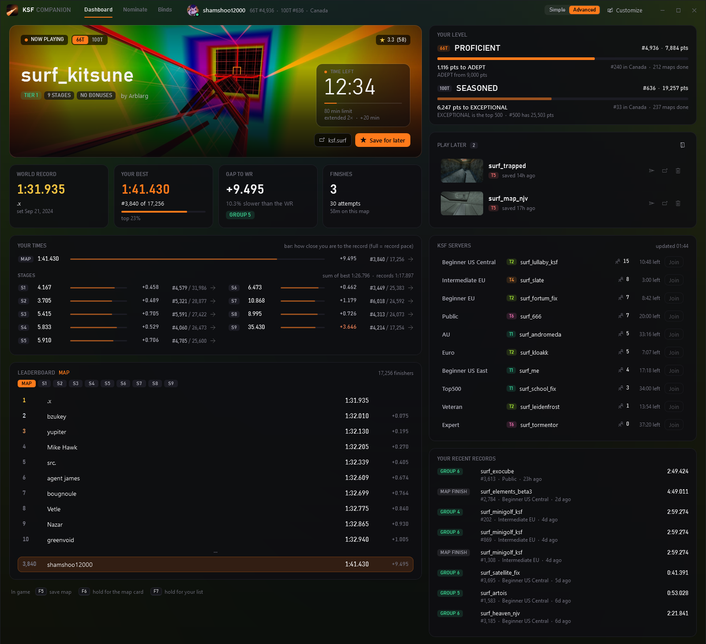
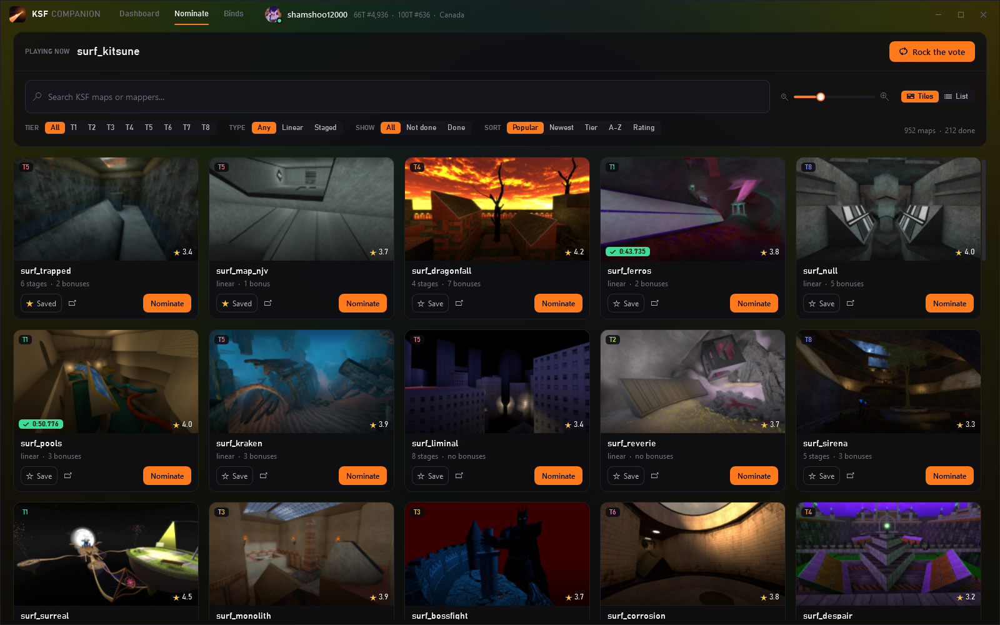
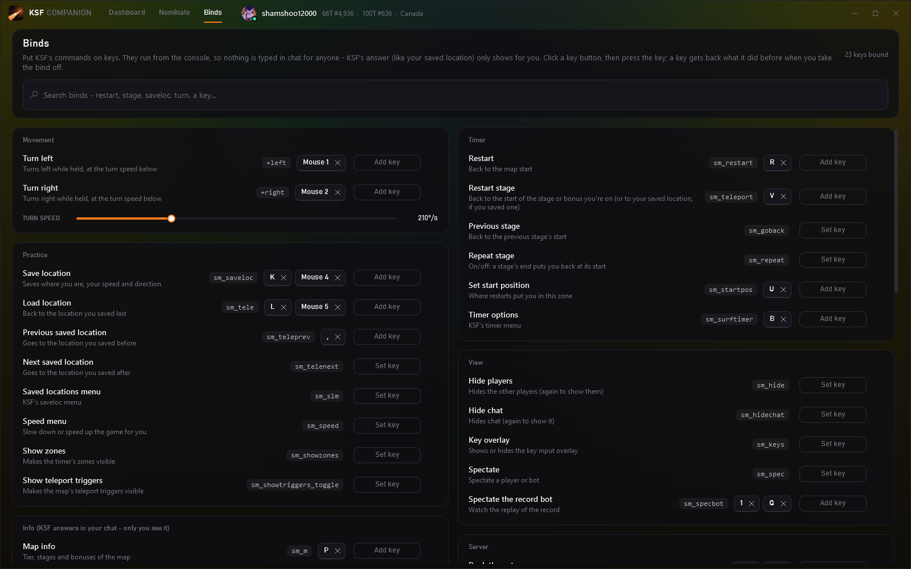

# KSF Companion

A second-monitor dashboard for **KSF surf** in **Counter-Strike: Source**.

## Download

### **[⬇ Download KSFCompanion.exe](../../releases/latest/download/KSFCompanion.exe)**

Double-click it. That's the whole install.

- No sign-in, no account, nothing else to install. It never asks for your Steam password.
- It finds your CS:S and your Steam account by itself.
- Start (or restart) CS:S once and it connects.

> **Windows says "Windows protected your PC"?**
> That shows for any new app that isn't signed. Click **More info → Run anyway**.

## What it does

### Dashboard

- **Live times:** your stage and bonus times appear as soon as you finish, with the gap to the record.
- **Map info:** see the map you're on, its tier, the top 10, and the time left (including extends).
- **Your rank:** see your KSF title, rank and points on 66 and 100 tick.
- **Servers:** see every KSF server, who's on, and the map, and join in one click.
- **Play later:** press F5 in game to save a map for later.

### Nominate

- Search every KSF map (typos are OK), filter by tier, type, or done / not done.
- Nominate or rock the vote in one click.

### Binds

- Put restart, restart stage, save/load location and turn binds on any key.
- Your binds already in the game show up here. Nothing shows in chat.

## Is it safe?

**VAC:** ✅ Safe. It never touches the game's memory; it only uses config files and console commands, like a normal bind.

**Your Steam account:** 🔒 Never touched. It never asks for, reads or stores your Steam password or login. It only looks up your public Steam ID (the one on your profile page) so it can show your own KSF times.

## Update or remove

- **Update:** download the new version and double-click it. Your settings stay.
- **Remove:** go to Windows **Settings → Apps → KSF Companion → Uninstall**. It also removes its files from CS:S and puts your old key binds back.

**Needs:** Windows 10 or 11 and Counter-Strike: Source on Steam.

---

Not affiliated with KSF. Map data and pictures come from ksf.surf. ·
Build it yourself: `dotnet build KSFCompanion/KSFCompanion.csproj -c Release`
